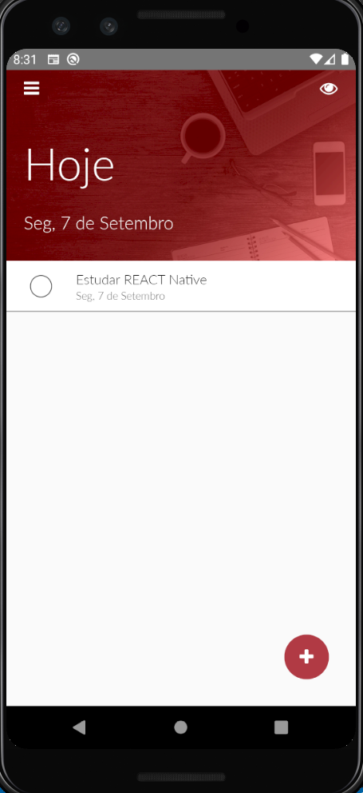
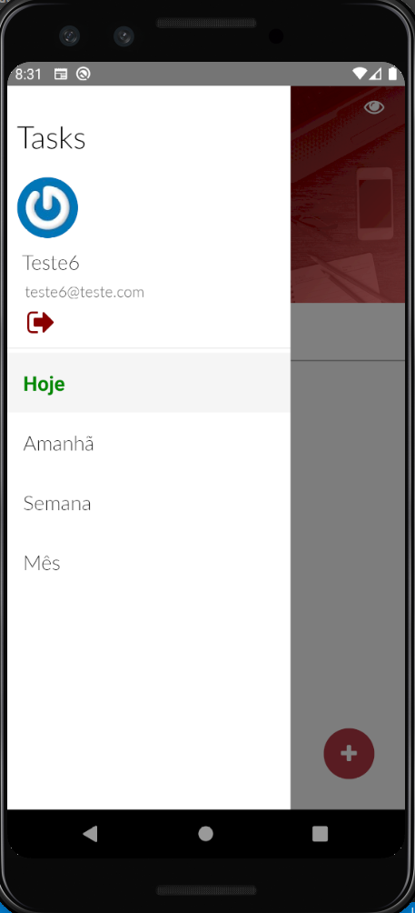
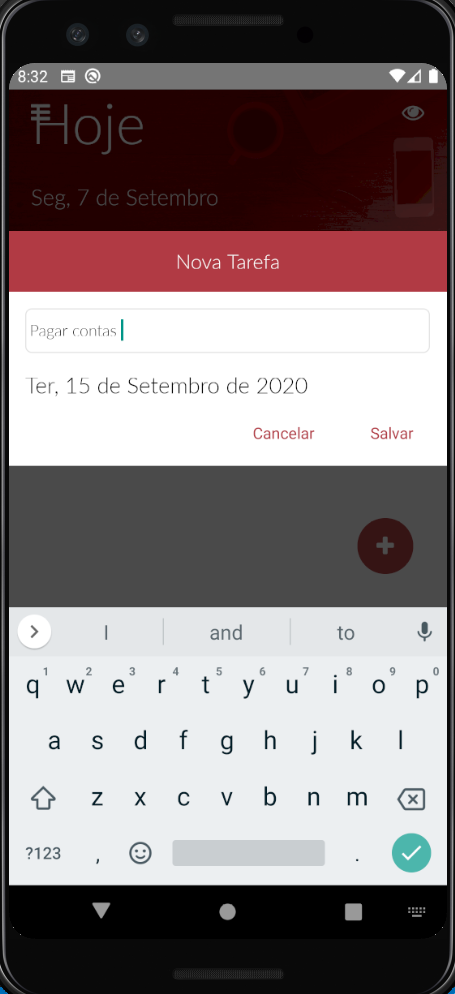
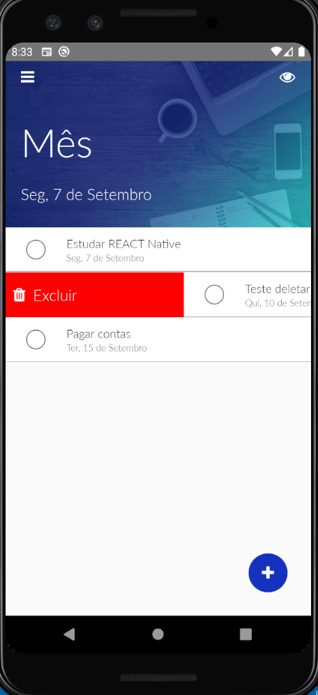

<h1 align="center">
     Tasks 
    Node.js | React Native
</h1>

## Featured Images

     
     
     
     
     
     
     

## Technologies

-  [Node.js](https://nodejs.org/en/)
-  [Express](https://expressjs.com/)
-  [bcrypt](https://www.npmjs.com/package/bcrypt)
-  [JTW](https://jwt.io/)
-  [Passport](http://www.passportjs.org/packages/passport-jwt/)
-  [Knexjs](http://knexjs.org)
-  [consign](https://www.npmjs.com/package/consign)
-  [postgres](https://www.postgresql.org)
-  [docker](https://www.docker.com)
-  [React Native](https://reactnative.dev)
-  [axios](https://github.com/axios/axios)

---
Project developed in [Cod3r](https://www.cod3r.com.br/) classes.